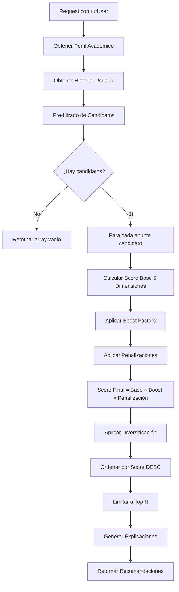

# 📚 Sistema de Recomendación de Apuntes - MiEspacioUBB

## 📋 Tabla de Contenidos

- [Visión General](#visión-general)
- [Arquitectura del Sistema](#arquitectura-del-sistema)
- [Algoritmo de Scoring](#algoritmo-de-scoring)
- [Dimensiones del Algoritmo](#dimensiones-del-algoritmo)
- [Factores Multiplicativos](#factores-multiplicativos)
- [Flujo de Ejecución](#flujo-de-ejecución)
- [Ejemplos Prácticos](#ejemplos-prácticos)
- [Ajustes y Configuración](#ajustes-y-configuración)
- [APIs Disponibles](#apis-disponibles)
- [Métricas de Éxito](#métricas-de-éxito)

---

## 🎯 Visión General

El **Sistema de Recomendación de Apuntes** es el componente central de MiEspacioUBB, diseñado para personalizar la experiencia de aprendizaje de cada estudiante mediante un algoritmo híbrido multidimensional que considera:

- ✅ **Perfil académico del usuario** (asignaturas cursantes, intereses, rendimiento)
- ✅ **Preferencias de estudio** (métodos preferidos, tipos de contenido)
- ✅ **Calidad del contenido** (valoraciones, popularidad, reputación)
- ✅ **Contexto temporal** (frescura del contenido, momento del semestre)
- ✅ **Comportamiento histórico** (interacciones previas, patrones de uso)

### 🏆 Objetivos del Sistema

1. **Maximizar la relevancia**: Mostrar apuntes útiles para las asignaturas actuales del estudiante
2. **Adaptarse al rendimiento**: Recomendar contenido apropiado según el nivel académico
3. **Respetar preferencias**: Priorizar tipos de apunte que coincidan con métodos de estudio
4. **Garantizar calidad**: Favorecer contenido bien valorado y confiable
5. **Fomentar exploración**: Incluir recomendaciones de descubrimiento (serendipity)

---

## 🏗️ Arquitectura del Sistema

### Estructura de Archivos

```
backend/src/
├── models/
│   ├── apunte.model.js                    # Modelo extendido con complejidad y temas
│   └── perfilAcademico.model.js           # Modelo extendido con historial de interacciones
├── services/
│   └── recomendacion.service.js           # Lógica principal del algoritmo
├── helpers/
│   └── recomendacion.helper.js            # Funciones auxiliares y cálculos
├── controllers/
│   └── recomendacion.controller.js        # Controladores de endpoints
├── validations/
│   └── recomendacion.validation.js        # Validación de parámetros
└── routes/
    └── recomendacion.routes.js            # Definición de rutas
```

### Flujo de Datos

```
Usuario → API Request
    ↓
[Validación de Parámetros]
    ↓
[Obtener Perfil Académico + Historial]
    ↓
[Pre-filtrado de Candidatos]
    ↓
[Cálculo de Scores Multidimensional]
    ↓
[Aplicación de Boosts y Penalizaciones]
    ↓
[Diversificación de Resultados]
    ↓
[Retornar Top N Recomendaciones]
```

---

## 📊 Algoritmo de Scoring

### Fórmula Principal

```javascript
ScoreFinal = (Σ Dimensión_i × Peso_i) × BoostFactor × Penalización
```

### Pesos de las Dimensiones

| Dimensión                  | Peso | Descripción                             |
| -------------------------- | ---- | --------------------------------------- |
| **Relevancia Académica**   | 35%  | Match con asignaturas cursantes/interés |
| **Rendimiento Contextual** | 25%  | Afinidad entre dificultad y desempeño   |
| **Método de Estudio**      | 20%  | Compatibilidad con preferencias         |
| **Calidad**                | 15%  | Valoraciones y popularidad              |
| **Temporal**               | 5%   | Frescura y patrones temporales          |

**Total:** 100%

---

## 🔍 Dimensiones del Algoritmo

### 1️⃣ Relevancia Académica (35%)

**Objetivo:** Evaluar qué tan pertinente es el apunte según el contexto académico del usuario.

**Componentes:**

```javascript
ScoreRelevancia =
  (matchAsignaturasCursantes × 0.50) +      // Cursando actualmente
  (matchAsignaturasInteres × 0.30) +         // Interés declarado
  (relacionPrerequisitos × 0.20)             // Asignaturas relacionadas
```

**Lógica de Cálculo:**

1. **Match Directo con Asignaturas Cursantes (50%):**

   - Si el apunte es de una asignatura que el usuario está cursando → Score máximo (0.50)
   - Prioridad absoluta para contenido de asignaturas actuales

2. **Match con Asignaturas de Interés (30%):**

   - Si el apunte es de una asignatura marcada como interés → Score alto (0.30)
   - Permite exploración de temas futuros

3. **Asignaturas Relacionadas (20%):**
   - Detecta relaciones entre asignaturas usando palabras clave comunes
   - Ejemplo: "Cálculo Diferencial" y "Cálculo Integral" comparten "Cálculo"
   - Score proporcional a la cantidad de relaciones encontradas

**Bonus Adicional:**

- Si las **etiquetas** del apunte coinciden con asignaturas del usuario → +0.10

**Ejemplo Práctico:**

```javascript
Usuario: {
  asignaturasCursantes: ["Programación Avanzada", "Base de Datos"],
  asignaturasInteres: ["Inteligencia Artificial"],
  informeCurricular: [
    { asignatura: "Programación Básica", ... },
    { asignatura: "Estructura de Datos", ... }
  ]
}

Apunte: {
  asignatura: "Programación Avanzada",
  etiquetas: ["algoritmos", "python"]
}

// Cálculo:
// - Match cursantes: 0.50 (está cursando)
// - Match interés: 0 (no aplica)
// - Relacionadas: 0.20 × 0.5 = 0.10 (relacionada con Prog. Básica)
// - Bonus etiquetas: 0 (no aplica)
// Total: 0.60 (excelente relevancia)
```

---

### 2️⃣ Rendimiento Contextual (25%)

**Objetivo:** Ajustar recomendaciones según el desempeño académico del usuario en cada asignatura.

**Filosofía:**

- **Rendimiento bajo** → Priorizar apuntes **básicos** (fundamentales, claros)
- **Rendimiento medio** → Balance de todos los niveles
- **Rendimiento alto** → Priorizar apuntes **avanzados** (complementarios, profundos)

#### 🔄 Tres Escenarios Soportados

El sistema es **flexible** y se adapta a la información disponible del usuario:

**1️⃣ ESCENARIO: Usuario tiene notas registradas** (Prioridad)

Si el usuario registró sus evaluaciones con notas, el sistema calcula el promedio ponderado:

```javascript
Promedio = Σ(Nota_i × Porcentaje_i) / Σ(Porcentaje_i)
```

**2️⃣ ESCENARIO: Usuario NO tiene notas, pero SÍ tiene complejidad auto-reportada**

Si el usuario optó por NO registrar notas pero indicó la complejidad percibida de sus evaluaciones mediante `ordenComplejidad` (1-5), el sistema **infiere** el rendimiento:

| ordenComplejidad | Rendimiento Inferido | Razón                                  |
| ---------------- | -------------------- | -------------------------------------- |
| 1-2 (Fácil)      | **Alto**             | Le pareció fácil → rinde bien          |
| 3 (Normal)       | **Medio**            | Dificultad normal                      |
| 4-5 (Difícil)    | **Bajo**             | Le pareció difícil → necesita refuerzo |

**3️⃣ ESCENARIO: Usuario NO tiene notas NI complejidad**

Si no hay información disponible (usuario nuevo o no completó perfil), se usa **score neutro** (0.5).

---

#### Matriz de Preferencias

Una vez determinado el nivel de rendimiento (por notas o complejidad), se usa esta matriz:

| Complejidad Apunte | Rendimiento Bajo  | Rendimiento Medio | Rendimiento Alto |
| ------------------ | ----------------- | ----------------- | ---------------- |
| **Básico**         | 1.0 (ideal)       | 0.7 (aceptable)   | 0.4 (poco útil)  |
| **Intermedio**     | 0.7               | 1.0 (ideal)       | 0.8              |
| **Avanzado**       | 0.3 (muy difícil) | 0.7               | 1.0 (ideal)      |

---

#### Ejemplos Prácticos

**Ejemplo 1: Usuario con Notas**

```javascript
Usuario en "Cálculo II": {
  evaluaciones: [
    { nota: 4.2, porcentaje: 30 },  // Certamen 1
    { nota: 3.8, porcentaje: 30 },  // Certamen 2
    { nota: 4.5, porcentaje: 40 }   // Examen
  ]
}
// Promedio = (4.2×0.3 + 3.8×0.3 + 4.5×0.4) = 4.2
// → Rendimiento: BAJO (< 4.5)

Apunte: {
  asignatura: "Cálculo II",
  complejidad: "Básico"
}

// Score: 1.0 (perfecto para reforzar bases)
```

**Ejemplo 2: Usuario SIN Notas, CON Complejidad**

```javascript
Usuario en "Programación Avanzada": {
  evaluaciones: [],  // Sin notas registradas
  ordenComplejidad: 5  // Le pareció muy difícil
}
// → Rendimiento inferido: BAJO (complejidad 4-5)

Apunte: {
  asignatura: "Programación Avanzada",
  complejidad: "Básico"  // Fundamentos
}

// Score: 1.0 (ideal, necesita material básico)
```

**Ejemplo 3: Usuario SIN Información**

```javascript
Usuario nuevo o sin perfil completo: {
  evaluaciones: [],
  ordenComplejidad: null
}

// → Score neutro: 0.5 (sin sesgo)
```

---

### 3️⃣ Método de Estudio (20%)

**Objetivo:** Recomendar tipos de apunte compatibles con las preferencias de estudio del usuario.

**Mapeo Tipo-Método:**

```javascript
{
  "Resumen": ["lectura", "visual", "síntesis", "repaso"],
  "Ejercicios resueltos": ["práctica", "problemas", "ejercicios"],
  "Guía de estudio": ["estructurado", "guiado", "organizado"],
  "Mapa conceptual": ["visual", "esquemas", "diagramas"],
  "Ayudantía": ["práctica", "ejemplos", "resolución"],
  "Apuntes de clase": ["lectura", "teoría", "complemento"],
  "Formulario": ["referencia", "consulta", "repaso"],
  "Proyecto": ["práctica", "aplicación", "integración"]
}
```

**Cálculo:**

```javascript
Score = (Métodos Coincidentes) / (Total Métodos Preferidos)
```

**Ejemplo Práctico:**

```javascript
Usuario: {
  metodosEstudiosPreferidos: ["visual", "práctica", "esquemas"];
}

Apunte: {
  tipoApunte: "Mapa conceptual";
  // Métodos compatibles: ["visual", "esquemas", "diagramas"]
}

// Overlap: ["visual", "esquemas"] → 2 coincidencias
// Score: 2/3 = 0.67 (buena compatibilidad)
```

---

### 4️⃣ Calidad (15%)

**Objetivo:** Favorecer contenido de alta calidad y confiabilidad.

**Componentes:**

```javascript
ScoreCalidad =
  (valoraciónNormalizada × 0.60) +           // Promedio de estrellas
  (confiabilidadValoración × 0.25) +         // Cantidad de votos
  (ratioDescargasVistas × 0.15)              // Popularidad genuina
```

**1. Valoración Normalizada (60%):**

```javascript
Valoración normalizada = Promedio Valoración / 5.0
// Ejemplo: 4.3/5.0 = 0.86
```

**2. Confiabilidad según Cantidad de Valoraciones (25%):**

Fórmula sigmoide para dar más peso a apuntes con más votos:

```javascript
Confiabilidad = 1 - 1 / (1 + cantidadValoraciones / 10);
```

| Valoraciones | Confiabilidad | Interpretación |
| ------------ | ------------- | -------------- |
| 1            | 0.09          | Muy baja       |
| 5            | 0.33          | Baja           |
| 10           | 0.50          | Media          |
| 20           | 0.67          | Alta           |
| 50           | 0.83          | Muy alta       |
| 100+         | 0.91+         | Excelente      |

**3. Ratio Descargas/Vistas (15%):**

Detecta apuntes genuinamente útiles vs. clickbait:

```javascript
Ratio = Descargas / Visualizaciones;
// Ratio alto → Los usuarios que lo ven lo descargan (señal positiva)
// Ratio bajo → Muchas vistas pero pocas descargas (posible clickbait)
```

**Ejemplo Práctico:**

```javascript
Apunte: {
  valoracion: {
    promedioValoracion: 4.5,
    cantidadValoraciones: 23
  },
  visualizaciones: 150,
  descargas: 95
}

// Componente 1: 4.5/5.0 = 0.90 × 0.60 = 0.540
// Componente 2: 1-(1/(1+23/10)) = 0.697 × 0.25 = 0.174
// Componente 3: 95/150 = 0.633 × 0.15 = 0.095
// Total: 0.809 (excelente calidad)
```

---

### 5️⃣ Temporal (5%)

**Objetivo:** Considerar frescura del contenido, patrones de uso temporal y relevancia por semestre académico.

**Componentes:**

```javascript
ScoreTemporal =
  (frescuraApunte × 0.40) +                  // Qué tan nuevo es
  (tendenciaInteracción × 0.35) +            // Actividad reciente del usuario
  (momentoSemestre × 0.25)                    // Relevancia por semestre académico
```

**1. Frescura del Apunte (40%):**

```javascript
// Apuntes recientes (< 30 días): Score 1.0
// 30-180 días: Decremento lineal a 0.5
// Más antiguos: Score base 0.5
```

**2. Tendencia de Interacción (35%):**

```javascript
AccionesRecientes = Acciones en últimos 30 días
Score = min(AccionesRecientes / 10, 1.0)
// Usuario activo → Score alto
// Usuario inactivo → Score neutro (0.5)
```

**3. Momento del Semestre (25%) - IMPLEMENTADO:**

**Algoritmo:** Extrae **TODOS** los semestres de las asignaturas cursantes y prioriza apuntes recientes de **CUALQUIERA** de esos semestres.

**Flujo:**

1. **Extraer semestres** de todas las asignaturas cursantes del usuario
2. **Obtener semestre** del apunte candidato
3. **Comparar coincidencia** y aplicar scoring graduado

**Scoring Graduado:**

Si el apunte ES de uno de los semestres actuales:

| Antigüedad         | Score | Razón                  |
| ------------------ | ----- | ---------------------- |
| < 7 días           | 1.0   | Muy reciente, ideal    |
| 7-30 días          | 0.9   | Reciente, muy bueno    |
| 30-90 días         | 0.7   | Relativamente reciente |
| > 90 días          | 0.6   | Antiguo pero relevante |
| Semestre diferente | 0.4   | Menor prioridad        |
| Sin semestre/error | 0.5   | Score neutro           |

**Ejemplo Multi-Semestre:**

```javascript
Usuario cursando:
- "Cálculo I" (semestre 2)
- "Programación Avanzada" (semestre 3)
- "Base de Datos" (semestre 4)

→ Semestres extraídos: [2, 3, 4]

Apuntes candidatos:
1. Prog Avanzada (sem 3) - subido hace 5 días  → score: 1.0 ✅
2. Cálculo I (sem 2) - subido hace 15 días     → score: 0.9 ✅
3. Base de Datos (sem 4) - subido hace 2 meses → score: 0.7 ✅
4. Estadística (sem 5) - subido hace 3 días    → score: 0.4 ⚠️  (diferente semestre)
5. Álgebra (sem 1) - subido ayer               → score: 0.4 ⚠️  (diferente semestre)

// Nota: Los semestres 2, 3 y 4 tienen IGUAL prioridad base
// La frescura (días desde subida) es el factor diferenciador
```

**Ventajas:**

- ✅ **Contexto académico**: Entiende que un estudiante de semestre 3 necesita contenido de semestre 3
- ✅ **Multi-semestre**: Soporta estudiantes cursando asignaturas de múltiples semestres simultáneamente
- ✅ **Priorización inteligente**: Combina relevancia de semestre con frescura del contenido
- ✅ **Robustez**: Maneja errores con score neutro (0.5)

---

## ⚡ Factores Multiplicativos

### 🚀 Boost Factors (Multiplicadores Positivos)

Amplifican el score cuando se cumplen condiciones especiales:

```javascript
BoostTotal = Factor1 × Factor2 (máximo 2.0)
```

| Condición                  | Multiplicador | Razón                                     |
| -------------------------- | ------------- | ----------------------------------------- |
| Asignatura cursante actual | ×1.5          | Máxima prioridad para contenido relevante |
| Alta calidad del contenido | ×1.3          | Promociona apuntes bien valorados         |

**Criterios para Alta Calidad:**

- Promedio de valoración ≥ 4.5 estrellas
- Mínimo 10 valoraciones (confiabilidad)

**Ejemplo:**

```javascript
// Apunte de asignatura cursante (×1.5) con alta calidad (×1.3)
BoostTotal = 1.5 × 1.3 = 1.95
```

### ⛔ Penalizaciones (Factores Negativos)

Reducen el score cuando hay razones para evitar el apunte:

```javascript
PenalizaciónTotal = Factor1 × Factor2 × Factor3 (mínimo 0.1)
```

| Condición               | Multiplicador | Razón                         |
| ----------------------- | ------------- | ----------------------------- |
| Estado ≠ 'Activo'       | ×0.1          | Apunte suspendido/en revisión |
| Ya valorado por usuario | ×0.3          | Evitar contenido ya conocido  |
| Ya descargado           | ×0.4          | Usuario ya posee el apunte    |

**Ejemplo:**

```javascript
// Apunte ya valorado (×0.3) y ya descargado (×0.4)
PenalizaciónTotal = 0.3 × 0.4 = 0.12
// Score final será muy bajo para evitar recomendar contenido ya visto
```

---

## 🔄 Flujo de Ejecución

### Paso a Paso del Algoritmo



### 1. Pre-filtrado Inteligente

**Objetivo:** Reducir espacio de búsqueda solo a candidatos relevantes.

```javascript
Candidatos = Apuntes donde:
  - estado === 'Activo'
  - asignatura IN (cursantes ∪ interés ∪ relacionadas)
  - _id NOT IN (apuntes ya valorados)
```

**Ventajas:**

- ⚡ Reduce carga computacional
- 🎯 Enfoca el algoritmo en contenido relevante
- 🚫 Evita recomendar apuntes ya conocidos

### 2. Cálculo de Score

Para cada candidato:

```javascript
// 1. Dimensiones base
const scoreRelevancia = calcular() × 0.35
const scoreRendimiento = calcular() × 0.25
const scoreMetodo = calcular() × 0.20
const scoreCalidad = calcular() × 0.15
const scoreTemporal = calcular() × 0.05

// 2. Suma ponderada
const scoreBase = suma de dimensiones

// 3. Factores multiplicativos
const boost = calcularBoosts()
const penalizacion = calcularPenalizaciones()

// 4. Score final
const scoreFinal = scoreBase × boost × penalizacion
```

### 3. Diversificación de Resultados

**Objetivo:** Evitar saturación de una sola asignatura y fomentar exploración.

**Configuración:**

```javascript
CONFIG_DIVERSIDAD = {
  maxPorAsignatura: 4, // Máximo 4 apuntes de la misma asignatura
  porcentajeSerendipity: 0.15, // 15% de recomendaciones exploratorias
  diversidadTipos: true, // Variar tipos de apunte
};
```

**Proceso:**

1. **Separar recomendaciones:**

   - 85% alta relevancia (ordenadas por score)
   - 15% exploración (scores más bajos pero diversos)

2. **Aplicar restricciones de diversidad:**

   - Limitar apuntes por asignatura
   - Variar tipos de apunte
   - Balancear complejidades

3. **Combinar resultados:**
   - Mantener orden por score
   - Garantizar diversidad temática

**Ejemplo:**

```javascript
// Sin diversificación:
Top 10 = [
  Prog1, Prog2, Prog3, Prog4, Prog5,  // 5 de Programación
  Prog6, Prog7, BD1, BD2, BD3          // 2 más de Prog, 3 de BD
]

// Con diversificación (max 4 por asignatura):
Top 10 = [
  Prog1, Prog2, Prog3, Prog4,          // 4 de Programación (límite)
  BD1, BD2, BD3, BD4,                  // 4 de Base de Datos
  IA1, Calc1                           // 2 exploratorias (serendipity)
]
```

---

## 💡 Ejemplos Prácticos

### Caso 1: Estudiante con Dificultades

**Perfil:**

```javascript
{
  rutUser: "20.123.456-7",
  asignaturasCursantes: ["Cálculo Integral"],
  informeCurricular: [
    {
      asignatura: "Cálculo Integral",
      evaluaciones: [
        { nota: 3.8, porcentaje: 40 },
        { nota: 4.1, porcentaje: 30 }
      ]
      // Promedio: 3.93 (bajo)
    }
  ],
  metodosEstudiosPreferidos: ["práctica", "ejemplos"]
}
```

**Recomendaciones Generadas:**

1. **Apunte: "Ejercicios Resueltos de Integrales Básicas"**

   - Relevancia: 0.50 (cursante) → ×0.35 = 0.175
   - Rendimiento: 1.0 (básico para bajo) → ×0.25 = 0.250
   - Método: 1.0 (match práctica) → ×0.20 = 0.200
   - Calidad: 0.85 → ×0.15 = 0.128
   - Temporal: 0.70 → ×0.05 = 0.035
   - **Score Base: 0.788**
   - Boost: 1.5 (cursante) × 1.3 (alta calidad: 4.6★, 15 valoraciones) = 1.95
   - **Score Final: 1.537** ⭐ (Top 1)

2. **Apunte: "Formulario Completo de Integrales"**
   - Score similar, priorizado por ser "referencia rápida"

**Razón:** El sistema detectó el bajo rendimiento y priorizó contenido básico y práctico.

---

### Caso 2: Estudiante Avanzado

**Perfil:**

```javascript
{
  asignaturasCursantes: ["Machine Learning"],
  informeCurricular: [
    {
      asignatura: "Machine Learning",
      evaluaciones: [{ nota: 6.2, porcentaje: 100 }]
      // Promedio: 6.2 (alto)
    }
  ],
  metodosEstudiosPreferidos: ["lectura", "teoría"]
}
```

**Recomendaciones Generadas:**

1. **Apunte: "Teoría Avanzada de Deep Learning"**
   - Rendimiento: 1.0 (avanzado para alto) → ×0.25 = 0.250
   - Método: 1.0 (match lectura/teoría) → ×0.20 = 0.200
   - **Score Final: 1.203** ⭐

**Razón:** El sistema reconoció alto rendimiento y priorizó contenido avanzado teórico.

---

### Caso 3: Usuario Nuevo (Cold Start)

**Perfil:**

```javascript
{
  asignaturasCursantes: ["Introducción a la Programación"],
  informeCurricular: [],  // Aún no hay historial
  metodosEstudiosPreferidos: ["visual"]
}
```

**Estrategia:**

- Usar score neutro (0.5) en dimensión de rendimiento
- Priorizar apuntes con muchas valoraciones (alta confiabilidad)
- Diversificar tipos para descubrir preferencias

**Recomendaciones:**

1. Apuntes más valorados de la asignatura
2. Variedad de tipos (resúmenes, ejercicios, mapas)
3. Enfoque en contenido popular y probado

---

## ⚙️ Ajustes y Configuración

### Modificar Pesos de Dimensiones

**Archivo:** `helpers/recomendacion.helper.js`

```javascript
export const PESOS_DIMENSIONES = {
  relevanciaAcademica: 0.35, // Modificar según necesidad
  rendimientoContextual: 0.25,
  metodoEstudio: 0.2,
  calidad: 0.15,
  temporal: 0.05,
};
```

**Recomendaciones:**

- Suma debe ser 1.0
- Aumentar `relevanciaAcademica` → Más foco en asignaturas actuales
- Aumentar `calidad` → Más conservador, solo contenido bien valorado
- Aumentar `temporal` → Priorizar contenido reciente

### Modificar Diversificación

```javascript
export const CONFIG_DIVERSIDAD = {
  maxPorAsignatura: 4, // Aumentar para más concentración
  porcentajeSerendipity: 0.15, // 0.0-0.3 recomendado
  diversidadTipos: true, // false para no restringir tipos
};
```

### Ajustar Mapeo Tipo-Método

**Archivo:** `helpers/recomendacion.helper.js`

```javascript
export const MAPEO_TIPO_METODO = {
  Resumen: ["lectura", "visual", "síntesis", "repaso"],
  // Agregar nuevos tipos o métodos
  "Tutorial Video": ["audiovisual", "paso a paso"],
};
```

---

## 🌐 APIs Disponibles

### 1. Recomendaciones Personalizadas

**Endpoint:** `GET /api/recomendaciones/personalizadas`

**Autenticación:** Requerida (JWT)

**Parámetros:**

```javascript
{
  rutUser: "xx.xxx.xxx-x",    // Requerido
  limite: 20                   // Opcional (default: 20, max: 50)
}
```

**Respuesta:**

```javascript
{
  success: true,
  message: "Recomendaciones generadas exitosamente (20 apuntes)",
  data: [
    {
      apunte: {
        _id: "...",
        nombre: "Ejercicios de Integrales",
        asignatura: "Cálculo Integral",
        tipoApunte: "Ejercicios resueltos",
        complejidad: "Básico",
        valoracion: {
          promedioValoracion: 4.5,
          cantidadValoraciones: 23
        },
        // ... resto de campos
      },
      scoreRecomendacion: 1.537,
      razonRecomendacion: "Estás cursando Cálculo Integral • Compatible con tu método de estudio"
    },
    // ... más recomendaciones
  ]
}
```

---

### 2. Recomendaciones Genéricas

**Endpoint:** `GET /api/recomendaciones/genericas`

**Autenticación:** NO requerida (público)

**Uso:** Para usuarios sin perfil académico o visitantes.

**Parámetros:**

```javascript
{
  limite: 20; // Opcional (default: 20, max: 50)
}
```

**Respuesta:**

```javascript
{
  success: true,
  message: "Recomendaciones populares obtenidas exitosamente",
  data: [
    {
      apunte: { /* ... */ },
      scoreRecomendacion: 0,
      razonRecomendacion: "Popular entre los usuarios"
    }
  ]
}
```

**Estrategia:** Retorna los apuntes más valorados y descargados globalmente.

---

### 3. Recomendaciones por Asignatura

**Endpoint:** `GET /api/recomendaciones/por-asignatura`

**Autenticación:** Requerida

**Uso:** Para obtener recomendaciones de una asignatura específica.

**Parámetros:**

```javascript
{
  asignatura: "Programación Avanzada",  // Requerido
  rutUser: "xx.xxx.xxx-x",              // Opcional (para personalización)
  limite: 10                             // Opcional (default: 10, max: 30)
}
```

**Respuesta:**

```javascript
{
  success: true,
  message: "Recomendaciones para Programación Avanzada obtenidas exitosamente",
  data: [
    {
      apunte: { /* ... */ },
      scoreRecomendacion: 1.234,
      razonRecomendacion: "Estás cursando Programación Avanzada • Alta valoración (4.7/5.0)"
    }
  ]
}
```

---

## 📈 Métricas de Éxito

### Métricas a Monitorear

Para evaluar efectividad del sistema de recomendaciones:

#### 1. **Precision@K**

```
Precision@10 = (Apuntes recomendados útiles en top 10) / 10
```

- **Objetivo:** > 70%
- **Útil = valorado positivamente o descargado tras recomendación**

#### 2. **Click-Through Rate (CTR)**

```
CTR = (Clicks en recomendaciones) / (Recomendaciones mostradas)
```

- **Objetivo:** > 15%

#### 3. **Download Rate**

```
Download Rate = (Descargas post-recomendación) / (Clicks)
```

- **Objetivo:** > 40%

#### 4. **Average Rating of Recommended**

```
Promedio valoración de apuntes recomendados vs. generales
```

- **Objetivo:** Recomendados > +0.5 vs. promedio general

#### 5. **Coverage**

```
Coverage = (Apuntes recomendados al menos 1 vez) / (Total apuntes activos)
```

- **Objetivo:** > 60% (evitar "long tail" ignorado)

### Implementación de Métricas

**Sugerencia:** Crear modelo `MetricasRecomendacion`:

```javascript
{
  fecha: Date,
  rutUser: String,
  apuntesRecomendados: [ObjectId],
  apuntesClickeados: [ObjectId],
  apuntesDescargados: [ObjectId],
  apuntesValorados: [ObjectId],
  tiempoSesion: Number
}
```

---

## 🔧 Mantenimiento y Mejoras Futuras

### Mejoras Sugeridas

1. **Filtrado Colaborativo Profundo:**

   - Implementar matriz de similitud entre usuarios
   - "Usuarios como tú también descargaron..."

2. **Machine Learning:**

   - Entrenar modelo con datos históricos
   - Aprendizaje de pesos óptimos automático

3. **Feedback Explícito:**

   - Permitir "marcar como no útil"
   - Ajustar recomendaciones en tiempo real

4. **Contexto Temporal Avanzado:**

   - Integrar calendario académico real
   - Detectar épocas de certámenes/exámenes

5. **Análisis de Contenido:**
   - NLP para extraer temas automáticamente
   - Similitud semántica entre apuntes

### Cómo Actualizar el Algoritmo

1. **Ajustar pesos** en `PESOS_DIMENSIONES`
2. **Modificar boost/penalizaciones** en funciones helper
3. **A/B Testing**: Ejecutar versiones paralelas y comparar métricas
4. **Documentar cambios** en este archivo

---

## 📝 Notas Técnicas

### Rendimiento

- **Complejidad:** O(n × m) donde n = candidatos, m = dimensiones
- **Optimización:** Pre-filtrado reduce n significativamente
- **Caché:** Considerar cachear recomendaciones por 1-2 horas

### Escalabilidad

- **Hasta 1000 usuarios:** Arquitectura actual suficiente
- **1000-10000 usuarios:** Implementar caché Redis
- **10000+ usuarios:** Considerar procesamiento asíncrono + workers

### Seguridad

- ✅ Validación de parámetros con Joi
- ✅ Autenticación JWT requerida (excepto genéricas)
- ✅ Sanitización de queries MongoDB
- ⚠️ Rate limiting recomendado (máx 10 req/min por usuario)

---

## 📚 Referencias

- [Sistemas de Recomendación - Ricci et al.](https://www.springer.com/gp/book/9780387858203)
- [Collaborative Filtering Techniques](https://dl.acm.org/doi/10.1145/371920.372071)
- [Content-Based Recommendation Systems](https://link.springer.com/chapter/10.1007/978-3-540-72079-9_10)

---

## 🤝 Contribución

Para modificar o extender el sistema:

1. Leer este documento completo
2. Identificar la dimensión/componente a modificar
3. Realizar cambios en archivos correspondientes
4. Probar con usuarios de prueba
5. Monitorear métricas de éxito
6. Actualizar documentación

---

## 📧 Contacto

Para consultas sobre el algoritmo de recomendación:

- **Repositorio:** MiEspacioUBB
- **Archivo principal:** `backend/src/services/recomendacion.service.js`

---

**Última actualización:** Noviembre 2025  
**Versión del algoritmo:** 1.0.0
